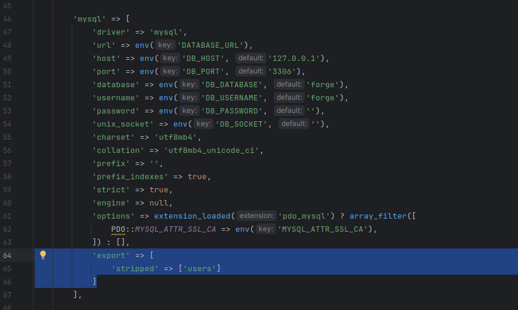

# laravel-mysqldump

## Purpose

* Easily dump whole databases or specific tables, with `artisan mysql:export`
* Easily import, with `artisan mysql:import`
* Strip content from tables, for example, strip the customer data but keep the product catalog.
 


## Setup

Install with: 
```bash
composer require corrivate/laravel-mysqldump
```

## Configuration
Configuration is not required. You can ad-hoc decide to strip tables by using `artisan mysql:export --strip=` with a comma-separated list of tables.

If your project has a standard set of tables you usually want to strip during export, you can configure them so that you can use the `--stripped` option. You can do so in in `config/database.php` like this:




## Credits

This package is built on top of [spatie/db-dumper](https://github.com/spatie/db-dumper). The original inspiration was the Magento packages [magerun2](https://github.com/netz98/n98-magerun2) and [mage-db-sync](https://github.com/jellesiderius/mage-db-sync).

## Corrivate
(en.wiktionary.org)

Etymology 

From Latin *corrivatus*, past participle of *corrivare* ("to corrivate").

### Verb

**corrivate** (*third-person singular simple present* **corrivates**, *present participle* **corrivating**, *simple past and past participle* **corrivated**)

(*obsolete*) To cause to flow together, as water drawn from several streams. 

